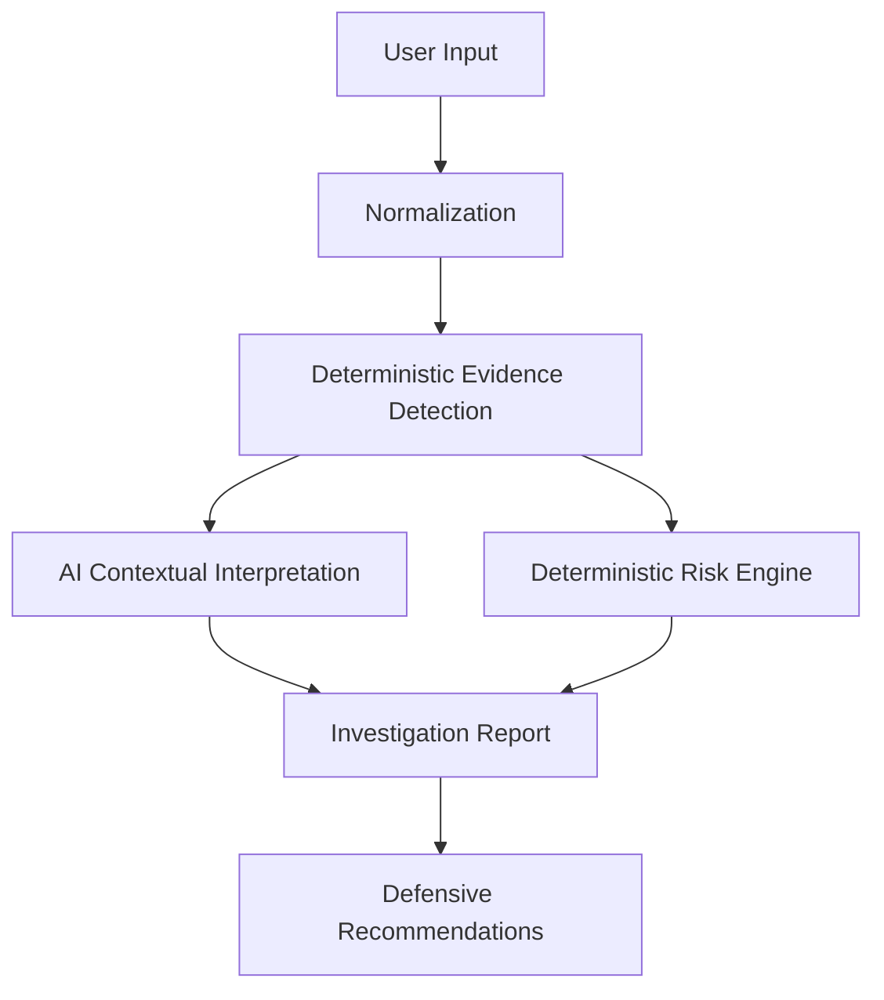

# Scamvera — Digital Scam Investigator

> An evidence-first cybersecurity workstation for investigating suspicious messages, URLs, and screenshots.

[**Live Demo**](https://scamvera.onrender.com/) • [**GitHub**](https://github.com/jainils278/Digital-Scam-Investigator)

[](#validation)
[](#validation)
[](https://www.typescriptlang.org/)
[](LICENSE)

Scamvera helps users investigate suspicious digital communications by separating:
- **Verified evidence** observed directly in the input
- **AI-generated contextual interpretation** explaining attacker tactics
- **Deterministic risk assessment** calculated as a deterministic 0–100 risk score
- **Defensive recommendations** grounded in detected indicators

Scamvera is built as a defensive, educational investigation workstation—**not a generic AI chatbot**.

```text
Verified Evidence → AI Interpretation → Deterministic Risk → Defensive Actions
```

---

## What is Scamvera?

Modern social engineering and digital fraud target users across SMS, email, messaging channels, and deceptive web links. Traditional detection systems often present two critical weaknesses:

1. **Keyword-only systems** rely on rigid blocklists that miss evolving phrasing and contextual manipulation.
2. **Unconstrained AI systems** can produce explanations that are not grounded in observable evidence and output arbitrary risk percentages without verifiable backing.

Scamvera solves this with a structured, phased pipeline:

```text
Observed Evidence → AI Interpretation → Deterministic Risk → Defensive Actions
```

By ensuring that every finding is linked to verifiable source artifacts before contextual analysis begins, Scamvera delivers explainable assessments that empower users to make informed defensive decisions.

---

## Why Scamvera?

- **Evidence-First Detection**: Every flagged indicator records exact character offsets within the source text for immediate verification.
- **Deterministic 0–100 Risk Score**: Scores are calculated through an explicit weighted formula based on corroborated indicators—not probabilistic claims.
- **Evidence-Grounded AI**: AI contextual explanations are validated against observed evidence and do not determine the deterministic risk score.
- **Passive URL Investigation**: Performs structural analysis of submitted URLs (domain structure, punycode, subdomain patterns) without fetching remote content or following redirects.
- **Screenshot Investigation**: Extracts text using an OCR pipeline with a local Tesseract.js fallback when external vision services are unavailable or unconfigured.
- **Defensive Guidance**: Generates prioritized, concrete actions (e.g., credential protection, reporting steps, blocking) tailored to the observed scam type.
- **Privacy-Conscious Architecture**: Zero persistent database storage for user submissions; server logs never record raw investigative message content.
- **Production-Ready**: Deployed with server-side API secret encapsulation, rate limiting, SSRF guards, and security headers.

---

## How It Works



1. **User Input**: Ingests suspicious communications via text, direct URLs, or uploaded screenshots across smishing, phishing, extortion, and impersonation categories.
2. **Normalization**: Standardizes whitespace and resolves Unicode variants, zero-width characters, and basic homoglyphs to neutralize common evasion tricks.
3. **Deterministic Evidence Detection**: Scans normalized content against specialized rule engines, identifying concrete indicators and cataloging exact character offsets.
4. **AI Contextual Interpretation**: Uses OpenAI GPT-4o (or local heuristic fallback) to synthesize human-readable attacker mechanics strictly bounded by verified indicators.
5. **Deterministic Risk Engine**: Aggregates verified indicator weights, category multipliers, and corroboration factors into a deterministic 0–100 risk score and risk tier.
6. **Investigation Report**: Assembles findings, evidence tokens, confidence levels, and severity classifications into an executive investigation report.
7. **Defensive Recommendations**: Delivers targeted, actionable defensive steps and educational breakdowns directly relevant to the confirmed threats.

---

## Investigation Modes

### 1. Text Investigation
Investigates SMS messages, phishing emails, direct messages, and pasted text communications. Detects urgency markers, financial pressure, credential harvesting phrasing, fake job offers, package delivery lures, and impersonation patterns.

### 2. URL Investigation
Performs passive structural analysis of submitted web addresses, inspecting domain structure, brand-spoofing patterns, subdomain stacking, IP-literal hostnames, and punycode/homoglyph signals.

> **Defensive Scope Notice**: Because Scamvera does not visit submitted URLs, follow redirects, or download remote content, URL investigation remains passive.

### 3. Screenshot / OCR Investigation
Extracts visible text from supported screenshots through the OCR pipeline, using a local Tesseract.js fallback when external vision services are unavailable or unconfigured. Extracted text is fed through the same evidence-first investigation pipeline.

---

## Evidence-First Design

Scamvera separates investigative findings into four distinct layers:

- **Observed Evidence**: Deterministically observed signals directly present in the submitted content, with exact character offsets.
- **AI Interpretation**: Contextual explanations synthesizing attacker psychology, typical scam flows, and intent. Advisory narrative validated against observed evidence.
- **Risk Assessment**: A deterministic 0–100 composite index calculated from verified indicator severities. Presented as a deterministic score (Minimal, Low, Medium, High, Critical)—not as a probability of fraud.
- **Defensive Actions**: Actionable, prioritized steps users can take to prevent credential theft, payment fraud, account compromise, or further engagement.

For complete scoring matrices, category weights, and threshold definitions, see [Docs/ARCHITECTURE.md](Docs/ARCHITECTURE.md).

---

## Security & Privacy

Scamvera is built with a defensive, privacy-first posture:

- **No Persistent Database**: Investigation submissions are processed ephemerally in-memory. No database, disk cache, or external log stores user messages.
- **Privacy-Safe Logging**: Application logs contain only high-level operational metadata (HTTP status, timing, IP hashes). Raw submitted text and images are never written to application logs.
- **Client-Side History**: Past investigations are stored exclusively in the user's browser `localStorage` and can be cleared at any time.
- **Server-Side Secret Management**: OpenAI API credentials remain strictly on the backend and are never sent or exposed to client-side code.
- **SSRF Defensive Barrier**: Server-side URL operations validate resolved destinations against private RFC 1918 ranges, loopback addresses (`127.0.0.1`), and cloud metadata endpoints (`169.254.169.254`).
- **Passive URL Analysis**: URLs are inspected structurally without making outbound HTTP requests or following redirects.
- **Input Normalization**: Normalizes homoglyphs and zero-width spaces before scanning to mitigate evasion.
- **Defense in Depth**: Features in-memory sliding-window rate limiting, request payload size caps, and hardened security headers (CSP, HSTS, X-Content-Type-Options).

> *Note: Scamvera is a defensive cybersecurity and educational tool. It does not provide certified legal forensics, guarantee total anonymity, or claim 100% protection against all attacks.*

---

## Technical Stack

- **Frontend**: React 19, TypeScript, Vite, Custom Vanilla CSS (Dark mode analytical workstation)
- **Backend**: Node.js (>= 20), Express 5, TypeScript
- **AI Integration**: OpenAI API (GPT-4o) with a local heuristic fallback
- **OCR Engine**: Tesseract.js local fallback with multimodal OpenAI Vision support where configured
- **Testing**: Vitest (132 automated tests, 45-case validation suite)
- **Quality**: oxlint
- **Deployment**: Render (Single-origin Express server serving API endpoints and compiled frontend)

---

## Validation

The detection pipeline is continuously verified across comprehensive automated test suites:

- **132 / 132 Automated Tests Passing** (15 Vitest test suites)
- **45 / 45 Validation Dataset Cases Passing**:
  - 15 / 15 Confirmed Scam Scenarios (advance-fee fraud, smishing, crypto schemes, extortion)
  - 15 / 15 Legitimate Scenarios (order receipts, bank alerts, 2FA notifications)
  - 15 / 15 Ambiguous Scenarios (aggressive marketing, ambiguous surveys)
- **Evidence Offset Verification**: Flagged spans map to exact substring positions in the source input
- **AI Boundary Integrity**: Contextual layer is validated against verified indicators

---

## Production Deployment

Scamvera is deployed as a public production web service:

- **Live URL**: [https://scamvera.onrender.com/](https://scamvera.onrender.com/)
- **Architecture**: A single Express production service serves both the API endpoints and the compiled Vite frontend from a unified origin.
- **Secrets**: OpenAI API keys remain strictly server-side.
- **Health Endpoint**: Operational health and active engine status are available at `/api/health`.
- **Safety**: URL analysis remains strictly passive in production.

---

## Engineering Highlights

Key technical architectural highlights include:

- **Strict Evidence/Interpretation Separation**: Prevents LLM hallucinations from affecting deterministic risk scores.
- **SSRF-Resistant URL Guard**: Validates IP resolutions against CIDR blocks and cloud metadata IP ranges.
- **Multi-Phase Text Normalizer**: Resolves Unicode confusables, Cyrillic/Greek homoglyphs, and zero-width characters with exact index mapping.
- **Tiered OCR Architecture**: Combines cloud vision with a local Tesseract.js fallback for resilient text extraction.
- **In-Memory Sliding-Window Rate Limiter**: Enforces IP-based request throttling without external Redis overhead.
- **Client-Side Report Generator**: Dynamically generates downloadable investigation reports directly in the browser.
- **Deterministic 0–100 Risk Engine**: Uses transparent, auditable weighting matrices rather than opaque statistical guesses.

---

## Project Structure

```text
Digital-Scam-Investigator/
├── Frontend/           # React 19 UI workstation, analytical views, graph canvas
├── Backend/            # Express 5 API, deterministic detector, risk engine, SSRF guard
├── Tests/              # Vitest suites, adversarial tests, 45-case validation suite
├── Docs/               # Technical specifications, architecture docs, privacy details
├── .github/            # GitHub configuration and workflow files
├── package.json        # Root workspace configuration and scripts
└── vitest.config.ts    # Test suite runner configuration
```

---

## Run Locally

### Prerequisites
- Node.js >= 20.x
- npm >= 10.x

### Quick Start

```bash
# 1. Clone the repository
git clone https://github.com/jainils278/Digital-Scam-Investigator.git
cd Digital-Scam-Investigator

# 2. Install workspace dependencies
npm install

# 3. Configure environment variables (optional for local heuristic mode)
cp .env.example .env

# 4. Start local development servers
npm run dev
```

- **Frontend Workstation**: `http://localhost:5173`
- **Backend API**: `http://localhost:3001`
- **Health Check**: `http://localhost:3001/api/health`

*Note: If no `OPENAI_API_KEY` is configured in `.env`, Scamvera runs automatically in local heuristic mode.*

### Key Scripts

| Command | Description |
| --- | --- |
| `npm run dev` | Launch backend and frontend development servers concurrently |
| `npm run build` | Compile backend TypeScript and build the Vite production bundle |
| `npm test` | Execute the complete Vitest suite |
| `npm run test:validation` | Run the 45-case validation suite |
| `npm run lint` | Run static code analysis with oxlint |
| `npm start` | Run the production Express server |

---

## Important Disclaimer

Scamvera is a defensive cybersecurity and educational tool designed to assist users and analysts in identifying common digital deception, social engineering, and fraud patterns. Its assessments are evidence-based but are not legal guarantees that a message, URL, or sender is malicious or legitimate. Users must independently verify high-consequence communications through trusted, official out-of-band channels.

---

## License

This project is licensed under the [MIT License](LICENSE).
